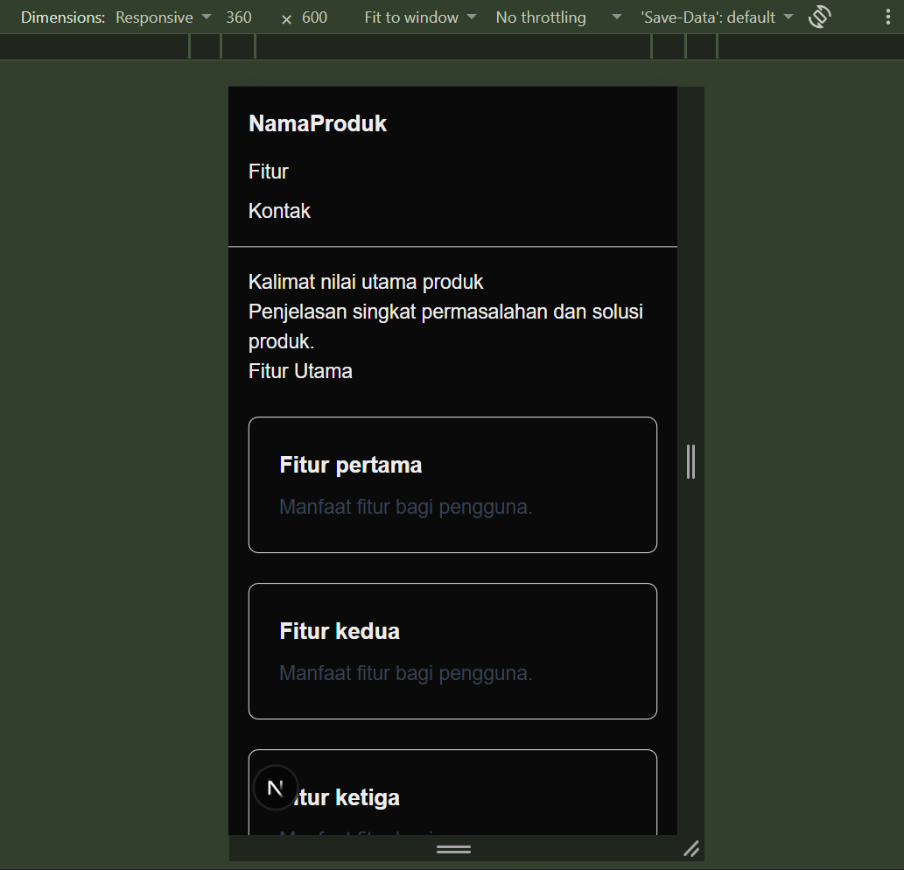
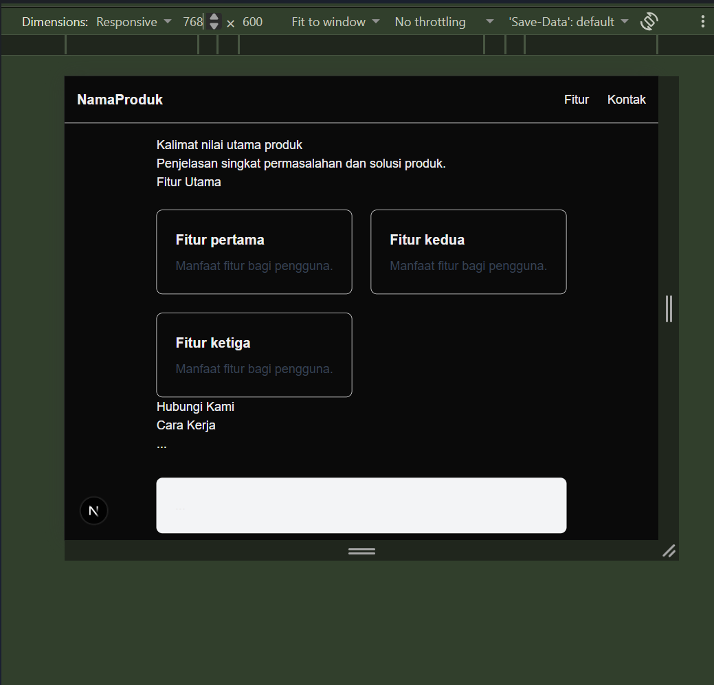
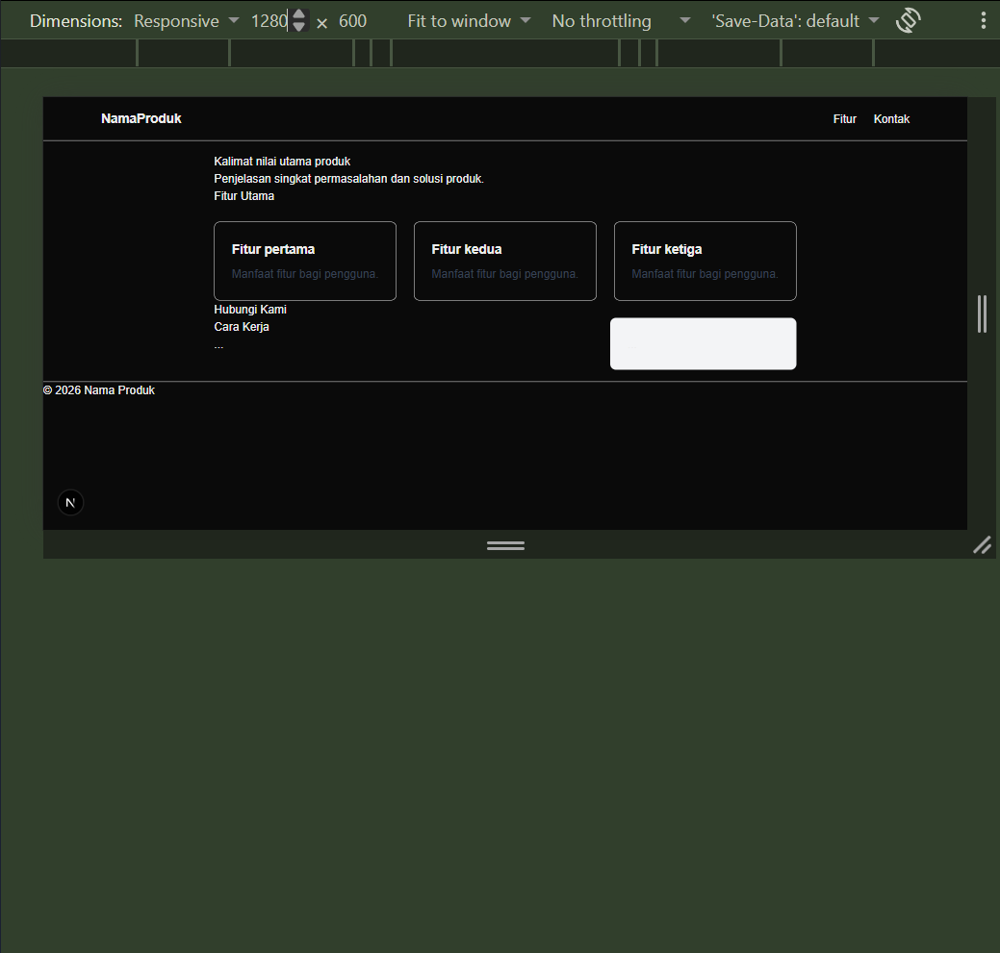
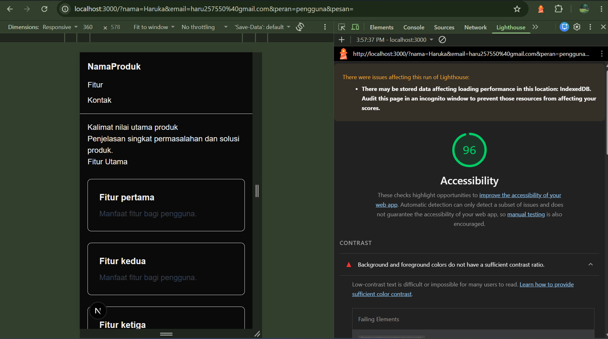
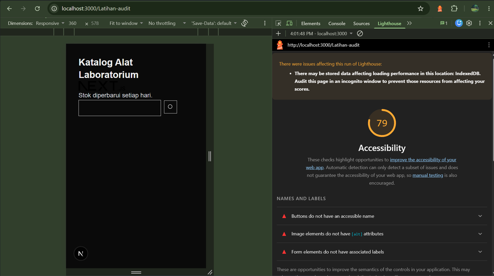

# Dokumen Teknis Modul 2 — HTML Semantik, Tailwind CSS, dan Aksesibilitas

Nama/NIM : 105224039
Repositori : https://github.com/putu-cpu/NiPutuHarukaIkeda_105224039_Pemweb2.git

## 1. Struktur Semantik

### Kerangka Landmark dan Hierarki Judul Halaman Utama

#### 1. Pengaturan Dokumen Tingkat Lanjut 
- **Atribut Bahasa (`<html lang="id">`)**: Diatur ke Bahasa Indonesia (`id`) agar pembaca layar (*screen reader*) melafalkan teks dokumen dengan aksen dan tata bahasa yang tepat.
- **Metadata Halaman**: Menentukan judul (`title`) dan deskripsi (`description`) halaman yang digunakan oleh peramban serta mesin pencari.

#### 2. Elemen Semantik dan Landmark ARIA 
- **Aksesibilitas Navigasi (`<a>` Skip Link)**: Memiliki elemen `<a href="#konten" className="sr-only focus:not-sr-only focus:p-2">` dengan teks "Lewati ke konten utama". Tautan ini disembunyikan secara visual dan baru muncul ketika menerima fokus papan ketik. Fungsinya agar pengguna papan ketik (*keyboard*) dan pembaca layar dapat melompati menu navigasi dan langsung menuju ke area konten utama.
- **`<header>` (banner)**: Berperan sebagai kepala halaman yang membungkus area navigasi atas.
- **`<nav>` (navigation)**: Membungkus menu navigasi utama yang berisi logo serta daftar tautan navigasi (`<ul>` dan `<li>`).
- **`<main id="konten">` (main)**: Membungkus seluruh isi konten utama halaman. Hanya terdapat satu elemen `<main>` pada halaman.
- **`<section>` (region)**: Setiap bagian halaman dibungkus menggunakan tag `<section>` dan diberi nama terprogram via atribut `aria-labelledby` yang merujuk pada ID judul bagian tersebut:
  - `aria-labelledby="judul-utama"` untuk bagian nilai utama produk.
  - `aria-labelledby="judul-fitur"` untuk bagian daftar fitur utama.
  - `aria-labelledby="judul-kontak"` untuk bagian formulir kontak.
  - `aria-labelledby="judul-cara"` untuk bagian tata cara kerja.
- **`<article>`**: Membungkus setiap kartu fitur di dalam daftar `<ul>` untuk menandai konten independen.
- **`<aside>` (complementary)**: Membungkus informasi tambahan yang tampil berdampingan dengan konten utama.
- **`<footer>` (contentinfo)**: Berada di kaki halaman untuk memuat informasi hak cipta.

#### 3. Hierarki Judul (Heading Hierarchy)
Hierarki judul tersusun secara runtut tanpa melompati tingkatan (*no skipped heading levels*):
- **`<h1>`**: Digunakan tepat satu kali untuk judul paling utama halaman pada section pertama (`id="judul-utama"`).
- **`<h2>`**: Digunakan secara konsisten untuk subjudul pada setiap `<section>` utama (`id="judul-fitur"`, `id="judul-kontak"`, `id="judul-cara"`).
- **`<h3>`**: Digunakan untuk judul spesifik di dalam tiap kartu fitur pada elemen `<article>`.

### Tangkapan Layar Pohon Aksesibilitas pada DevTools

Berikut adalah bukti tangkapan layar pohon aksesibilitas (*Accessibility Tree*) pada DevTools Chrome/Edge yang menunjukkan keberadaan landmark `banner`, `navigation`, `main`, `region`, dan `contentinfo`:

)

## 2. Tata Letak Responsif

### Tangkapan layar

| Lebar | Tangkapan Layar |
| :---: | :---: |
| **360 px** |  |
| **768 px** | |
| **1280 px** | |

### Kelas Flexbox, Grid, dan breakpoint beserta alasannya
Penerapan tata letak menggunakan pendekatan *mobile-first* bawaan Tailwind CSS v4, di mana kelas tanpa awalan berlaku untuk ukuran ponsel dasar, dan kelas berawalan breakpoint (`sm:`, `lg:`) berlaku saat layar mencapai ukuran tersebut ke atas:

1. **Elemen Navigasi (`<nav>`)**:
   - **Kelas**: `flex flex-col gap-3 p-4 sm:flex-row sm:items-center sm:justify-between`
   - **Alasan**: Navigasi menggunakan **Flexbox** karena merupakan tata letak satu dimensi. Pada layar ponsel, menu bertumpuk secara vertikal (`flex-col`). Mulai breakpoint `sm` (≥ 640 px), navigasi berubah menjadi horizontal (`sm:flex-row`), item berada di tengah vertikal (`sm:items-center`), dan terpisah di ujung kiri-kanan (`sm:justify-between`).

2. **Daftar Kartu Fitur (`<ul>`)**:
   - **Kelas**: `grid grid-cols-1 gap-6 sm:grid-cols-2 lg:grid-cols-3`
   - **Alasan**: Kartu fitur disajikan dalam bentuk kumpulan grid dua dimensi. Dasar ponsel menggunakan 1 kolom (`grid-cols-1`), berubah menjadi 2 kolom pada layar tablet (`sm:grid-cols-2`), dan 3 kolom pada layar desktop (`lg:grid-cols-3`).

3. **Tata Letak Konten dan Sidebar (`
`)**:
   - **Kelas**: `grid gap-8 lg:grid-cols-[2fr_1fr]`
   - **Alasan**: Membagi area konten utama dan *aside* secara proporsional saat berada di layar desktop. Pada ponsel dan tablet, elemen bertumpuk vertikal secara alami, kemudian pada breakpoint `lg` (≥ 1024 px) diatur berdampingan dengan lebar konten utama dua kali lipat dari lebar *aside* (`2fr 1fr`).

4. **Pembatas Lebar Maksimum (`<main>`)**:
   - **Kelas**: `mx-auto max-w-6xl p-4`

## 3. Audit Aksesibilitas

### Skor Lighthouse sebelum dan sesudah
| Halaman | Sebelum | Sesudah |
| :--- | :---: | :---: |
| Halaman Latihan (`/latihan-audit`) | 79 | 96 |
| Halaman Utama (`/`) | 96 | 100 |

#### Bukti Audit 1: Halaman Utama (Skor Awal 96)

#### Bukti Audit 2: Halaman Latihan (Skor Awal 79)

### Audit yang gagal, penyebab, dan perbaikan
| Audit yang Gagal | Penyebab | Perbaikan |
| :--- | :--- | :--- |
| `Background and foreground colors do not have a sufficient contrast ratio` | Rasio kontras warna teks deskripsi terhadap latar belakang kurang terang/kontras sehingga sulit dibaca oleh pengguna dengan gangguan penglihatan. | Mengubah kelas warna teks dari abu-abu muda menjadi lebih gelap (misalnya `text-gray-700`) agar memenuhi standar rasio kontras WCAG 2.2 minimal 4,5:1. |
| `Buttons do not have an accessible name` | Elemen `<button>` pencarian hanya berisi ikon SVG tanpa deskripsi teks yang dapat dibaca oleh pembaca layar (*screen reader*). | Menambahkan atribut `aria-label="Cari"` pada tombol dan `aria-hidden="true"` pada elemen `<svg>`. |
| `Image elements do not have [alt] attributes`| Elemen gambar `` tidak memiliki atribut teks alternatif (`alt`). | Menambahkan atribut `alt` yang deskriptif (misalnya `alt="Logo Next.js"`). |
| `Form elements do not have associated labels` | Elemen input pencarian (`<input type="search">`) tidak dihubungkan dengan tag `<label>`. | Menambahkan elemen `<label htmlFor="cari">Cari alat</label>` yang terhubung langsung dengan ID elemen input. |

### Pemeriksaan manual papan ketik
- **Urutan Fokus (*Focus Order*)**: 
  Saat diuji menggunakan navigasi tombol `Tab`, urutan fokus mengalir secara logis dari atas ke bawah dan kiri ke kanan:
  1. Tautan tersembunyi "Lewati ke konten utama" (*Skip link*)
  2. Logo dan tautan navigasi header (`Fitur`, `Kontak`)
  3. Elemen-elemen formulir kontak secara berurutan (Nama lengkap, Surel, Radio Peran, Pesan)
  4. Tombol "Kirim"
  5. Tautan pada bagian kaki halaman (*footer*)

- **Garis Fokus (*Focus Indicator*)**: 
  Seluruh elemen interaktif (`<a>`, `<button>`, `<input>`, `<textarea>`) memiliki penanda fokus visual yang jelas berupa garis luar (*outline*) tebal saat menerima fokus dari tombol `Tab`. Penanda ini dikonfigurasi menggunakan kelas utilitas Tailwind `focus-visible:outline-2 focus-visible:outline-offset-2 focus-visible:outline-blue-700`.

## 4. Kendala dan Penyelesaian

- **Kendala 1: Bahasa dokumen bawaan Next.js masih Bahasa Inggris (`lang="en"`)**
  - **Penyelesaian**: Mengubah atribut `lang="en"` menjadi `lang="id"` pada berkas `app/layout.tsx` agar pembaca layar (*screen reader*) dapat melafalkan teks bahasa Indonesia dengan artikulasi yang tepat.

- **Kendala 2: Peringatan kontras warna (*Contrast Ratio*) pada audit Lighthouse**
  - **Penyelesaian**: Menyesuaikan warna teks deskripsi dari warna abu-abu muda yang samar menjadi `text-gray-700` pada `app/page.tsx` sehingga rasio kontras warna terhadap latar belakang memenuhi standar WCAG 2.2 minimal 4,5:1.

- **Kendala 3: Penataan tata letak dua kolom (*main* dan *aside*) di layar ponsel (360 px)**
  - **Penyelesaian**: Menggunakan pendekatan *mobile-first* dengan tidak memasang kelas `grid-cols-2` secara langsung, melainkan membiarkannya bertumpuk (*stacked*) di ponsel dan baru mengaktifkan `lg:grid-cols-[2fr_1fr]` saat layar mencapai ukuran desktop (1024 px ke atas).

## 5. Catatan Pemanfaatan AI
- **Alat**: Gemini, Claude
- **Perintah Utama (*Prompt*)**:
  1. *"Jelasin fungsi tag semantik kayak header, nav, main, section, sama article di Next.js, belum paham bedanya sama div biasa"*
  2. *"Tolong jelasin maksud kelas Tailwind `grid grid-cols-1 sm:grid-cols-2 lg:grid-cols-3` sama `focus-visible:outline-2` itu cara kerjanya gimana?"*
  3. *"Aku dapet error audit Lighthouse 'Form elements do not have associated labels', ini maksudnya kenapa dan gimana cara nulis kode yang bener?"*
- **Bagian yang Digunakan**: 
  - Minta penjelasan konsep HTML Semantik dan peran landmark ARIA karena belum terlalu paham penggunaannya pada proyek Next.js.
  - Minta breakdown/penjelasan arti dari setiap kelas utilitas Tailwind CSS untuk tata letak responsif dan penanda fokus aksesibilitas.
  - Memahami arti pesan *error* pada audit Lighthouse beserta contoh perbaikan struktur kodenya.
- **Cara Memverifikasinya**:
  1. Membaca ulang penjelasan AI lalu mencoba menerapkan kodenya satu per satu di `app/page.tsx`.
  2. Mengecek struktur landmark pada tab **Elements > Accessibility** DevTools Chrome buat memastikan elemen semantik yang dipelajari beneran kebaca sebagai `banner`, `main`, dll.
  3. Menjalankan audit **Lighthouse Accessibility** di DevTools sampai skor halaman utama naik dari 96 jadi 100.
  4. Mempraktikkan pengujian manual dengan memencet tombol `Tab` di keyboard untuk melihat langsung alur fokus dan garis luar (*outline*) pada formulir.

